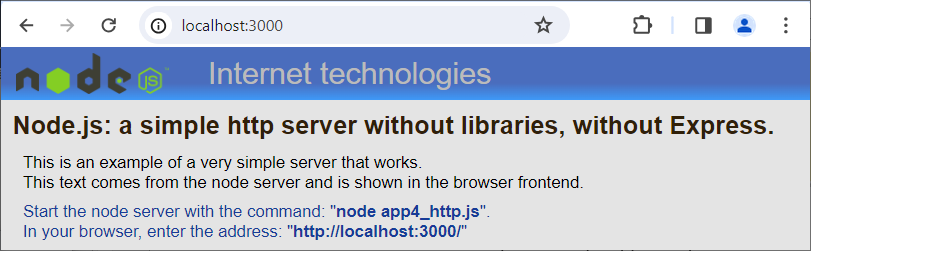

# Node.js: a simple http server

## Description

Node includes a built-in [http] library that, when launched, acts as an http server. After starting node, it does not stop working, but works in the background as a backend server, as a [Node.js JavaScript Runtime] process. The server responds to queries from web browsers on the defined port 3000. Returns the HTML page defined in the method: [response.end('....');] to the browser.

This is an example of a very simple server that works;
This text comes from the node server and is shown in the browser frontend.

.

## Install

Start the node server with the command: "node app4_http.js".
In your browser, enter the address: "http://localhost:3000/"